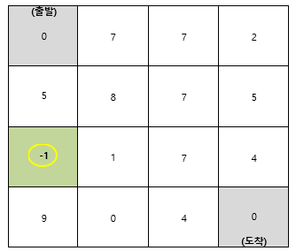
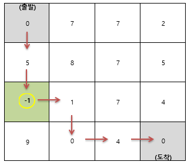

# 🧨준영이의 막힌 하수구 뚫기 🧨

 

 

 

## 🏆 알고리즘 문제 출제 대회 🏆

 

> 협업 알고리즘 문제 출제 대회 (2022.05.30 ~ 2021.05.31)

 

 

- **제출용 폴더 참조**

| 파일                  | 비고                            |
| --------------------- | ------------------------------- |
| Algo부울경2반1조.ppt  | 문제에 대한 명세서              |
| Algo부울경2반1조.docx | 문제에 대한 지문                |
| InputGenerator.py     | Input 생성 프로그램 코드        |
| sample_input.txt      | 샘플 테스트케이스용 5개 Input   |
| sample_output.txt     | 샘플 테스트케이스용 5개 Output  |
| eval_input.txt        | 평가 테이스케이스용 50개 input  |
| eval_output.txt       | 평가 테이스케이스용 50개 Output |
| solution.py           | 풀이코드 ( python )             |
| solution.java         | 풀이코드 ( java )               |

 

 

 

## 출제의도

 

 

이 문제는 다음과 같은 자료구조와 알고리즘을 활용하는 능력을 향상 시키는 것을 목적으로 출제 되었습니다.

1. 2차원 배열
   - 주어진 데이터를 2차원 배열로 표현할 수 있다.
   - 2차원 배열의 요소에 접근하여 값을 변경할 수 있다.
2. DFS ( 깊이 우선 탐색)
   - 루트 노드에서 시작해서 다음 브랜치로 넘어가기전에 해당 브랜치를 완벽하게 탐색할 수 있다.
3. 방문체크
   - visited 2차원 행렬을 이용하여 방문한 요소들을 재방문을 차단할 수 있다.
4. 백트래킹
   - 최단 경로를 찾아가는 도중 최단경로가 아닐경우 중단하고 다른 경로로 탐색할 수 있다.

## 문제지문

 

 

준영이가 오랜만에 집에서 때를 밀었더니 하수구가 막혀 물이 역류하기 시작하였다. 아뿔싸, 그녀가 도착하기 전 얼른 하수구를 뚫어 이를 해결해야 한다! 준영이는 빠르게 하수구를 뚫기 위해 아래 그림과 같은 모양의 하수구 도면을 얻었다. 해당 도면을 바탕으로 준영이는 하수구를 한 칸씩 이동하여 막힌 하수구를 끝까지 뚫어야 한다. 과연, 준영이는 하수구를 완전히 뚫기 위해 최소 몇 번을 시도해야 하는지 알아보자.

하수구의 출발점은 **(0, 0)**으로 도착점은 **(N-1, N-1)**이다. 해당 도면을 보면 하수구 각 구간의 막힌 정도가 표시되어 있다. 위의 그림에서 **(1, 0)** 지점에서는 **'5'**만큼 막혀있으므로 해당 칸을 뚫기 위해서는 5번의 시도 횟수가 발생한다. 보조 아이템인 락스가 존재하는 지점 **(2, 0)**에 도착하게 된다면 1씩 힘의 크기가 증가한다. 즉, 해당 칸에 도착하게 된다면 이후의 칸들에서는 힘의 크기가 **‘2’**가 되는 것이다. 만약, **(3, 0)** 지점인 9를 뚫기 위해서는 이전의 힘이었다면 9번을 시도하여야 하지만 증가된 힘으로 인하여 5번만 시도하면 된다. 

위의 그림을 바탕으로 하수구를 최소한의 횟수로 뚫는 방법을 알아보자. 먼저, 출발점에서 가장 작은 횟수로 뚫을 수 있는 **(1, 0)**으로 이동하여 5번의 횟수가 추가된다. 이후 이동 가능한 **(1, 1)**과 **(2, 0)** 중 힘을 증가시킬 수 있는 락스가 있는 칸으로 이동한다. 다시 주변 탐색을 통해 최소 횟수로 시도 가능한 곳으로 이동한다. 증가한 힘에 따라, **(3, 2)**를 뚫기 위해서는 ‘4번’이 아닌 ‘2번’의 시도만 하면 된다. 이런 방식으로 탐색을 하면, 준영이는 위 도면의 하수구를 뚫기 위해 총 ‘8번’만 시도하면 된다.

### 제한사항

1. 출발점은 (0, 0)으로 도착점은 (N-1, N-1)로 고정하며, 두 지점의 값은 항상 0이다. 
        ( 4 ≤ N ≤ 10 )
2. 한번에 뚫을 수 있는 힘의 세기는 1이다. (단, 락스 아이템 장착 후에는 장착 횟수만큼 추가된 힘으로 작업이 가능하다.)
3. 락스 아이템은 ‘-1’로 표현된다. 해당 칸에 도착하면 힘의 양이 ‘+1’만큼 증가한다. 
        (단, 횟수는 카운트 되지 않고 0으로     계산된다.)
4. 이동 방향은 상, 하, 좌, 우이다. 단, 지나온 길을 다시 되돌아갈 수 없다.  

### 입력사항

첫째 줄에 테스트 케이스 개수인 t가 주어진다. 다음 줄에는 행렬의 크기인 N이 주어진다. 지도의 크기는 최대 10 * 10 이다. 다음 줄부터는 지도의 크기만큼 2차원 배열 형태의 지도 정보가 주어진다.

### 출력사항

각 테스트 케이스의 답을 순서대로 출력하며, 각 케이스마다 줄의 시작에 #C 를 출력하여야 한다. 이때, C는 케이스의 번호이다. 같은 줄에 빈 칸을 하나 두고, 주어진 입력에서 출발지에서 도착지까지 가는 경로 중에 복구 작업에 드는 가장 적은 시도 횟수를 출력하시오.

### 입력예시

5

4

0 7 7 2

5 8 7 5

-1 1 7 4

9 0 4 0

4

0 4 8 2

6 2 5 6

3 9 3 2

-1 1 -1 0

5

0 2 6 6 8

8 3 1 2 9

9 9 4 3 6

6 6 8 2 2

2 -1 0 7 0

5

0 2 2 5 7

8 5 3 0 2

1 0 3 7 3

2 2 1 1 4

9 9 6 9 0

5

0 9 7 3 4

4 1 2 -1 0

2 6 8 7 9

0 3 1 5 9

0 6 -1 0 0

### 출력예시

\#1 8

\#2 10

\#3 15

\#4 15

\#5 10

### HINT

각 테스트케이스 별 최단 경로

**#1** 0>5>-1>1>0>4>0

**#2** 0>6>3>-1>1>-1>0 

**#3** 0>2>3>1>2>3>2>2>0

**#4** 0>2>5>0>2>1>1>4>0

**#5** 0>4>2>0>3>1>-1>0>0
